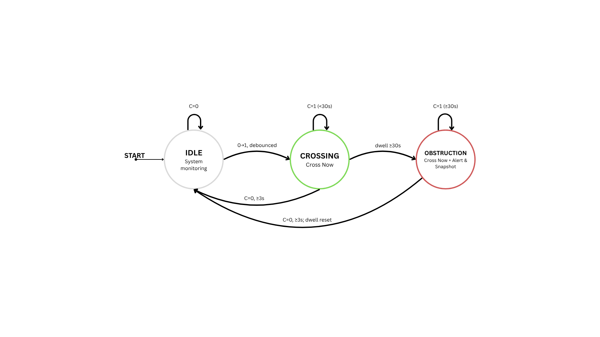
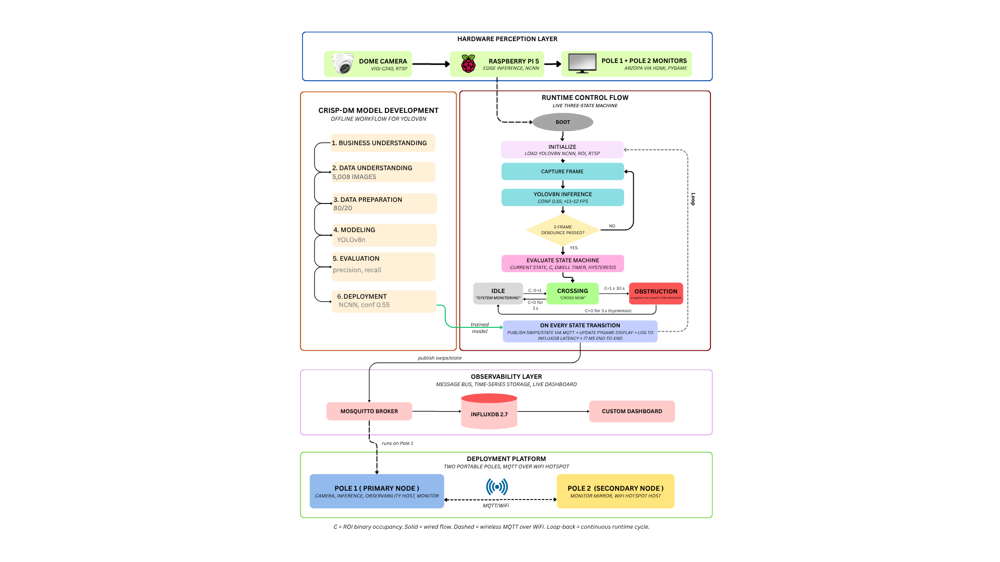

# SWiPS — Smart Warning and Pedestrian Safety System

> Edge AI pedestrian advisory system for unsignalized campus crosswalks using YOLOv8n on Raspberry Pi 5.

[](https://github.com/JyresaMae/SWiPS)
[](https://github.com/JyresaMae/SWiPS)
[](https://github.com/JyresaMae/SWiPS)
[](LICENSE)

---

## Overview

SWiPS is a two-pole portable edge AI system deployed at unsignalized pedestrian crosswalks in MSU-IIT (Mindanao State University – Iligan Institute of Technology). Each pole runs a YOLOv8n NCNN model on a Raspberry Pi 5, detecting pedestrians in real time and issuing visual advisories via an LED display. The two poles communicate over MQTT and log all events to InfluxDB.

The system implements a **3-state Moore machine FSM**:
- `IDLE` — no pedestrian detected
- `CROSSING` — pedestrian approaching/crossing
- `OBSTRUCTION` — pedestrian obstructing crosswalk



---

## System Architecture



The system spans four layers: **Hardware Perception** (VIGI C240 dome camera → Raspberry Pi 5 → ARZOPA monitors), **Runtime Control** (YOLOv8n NCNN inference → 3-frame debounce → Moore FSM), **Observability** (Mosquitto MQTT → InfluxDB 2.7 → custom dashboard), and **Deployment Platform** (two portable poles synced over Wi-Fi hotspot).

---

## Hardware

| Component | Specification |
|---|---|
| SBC | Raspberry Pi 5 (8GB) × 2 |
| Camera | Raspberry Pi Camera Module 3 |
| Display | LED advisory panel |
| Networking | Wi-Fi hotspot (Pole 1 as AP) |
| Power | Portable battery pack |

---

## Repository Structure

```
SWiPS/
├── pole1/                      # Pole 1 (Master) scripts
│   ├── swips_simple_detect.py  # Main detection loop
│   ├── display_controller.py   # LED display FSM controller
│   ├── mjpeg_bridge.py         # MJPEG video streaming
│   └── roi_calibrator.py       # ROI calibration tool
│
├── pole2/                      # Pole 2 (Client) scripts
│   ├── swips_simple_detect.py  # Main detection loop
│   ├── display_controller.py   # LED display FSM controller
│   └── swips_sysmon.py         # System monitor
│
├── server/                     # Node.js backend server
│   ├── server.js               # Main API + WebSocket server
│   ├── server_live.js          # Live data server
│   └── package.json
│
├── dashboard/                  # Web dashboard (HTML/CSS/JS)
│   ├── index.html
│   ├── script.js
│   ├── styles.css
│   └── js/
│       ├── core/               # Auth, routing, state, API
│       └── sections/           # Dashboard, analytics, alerts, compliance, etc.
│
├── models/
│   ├── best_ncnn_model/        # YOLOv8n NCNN weights (.param + .bin)
│   └── swips_final_v1/         # PyTorch weights (best.pt)
│
├── config/
│   └── roi_config_camera_dual.json   # ROI configuration
│
├── services/
│   └── swips-mjpeg.service     # Systemd service for MJPEG bridge
│
└── media/
    └── deployment/             # Field deployment photos (3 sites)
```

---

## Getting Started

### Prerequisites

**Both Poles:**
```bash
pip install ultralytics opencv-python paho-mqtt influxdb-client
```

**Pole 1 only (additional):**
```bash
# Node.js for dashboard server
curl -fsSL https://deb.nodesource.com/setup_18.x | sudo -E bash -
sudo apt install -y nodejs

# InfluxDB
sudo apt install -y influxdb2

# MQTT Broker (Mosquitto)
sudo apt install -y mosquitto mosquitto-clients
```

### Configuration

Edit the MQTT and InfluxDB settings in `pole1/swips_simple_detect.py` and `pole2/swips_simple_detect.py`:

```python
MQTT_BROKER = "10.42.0.1"   # Pole 1 IP (hotspot mode)
INFLUX_URL  = "http://localhost:8086"
INFLUX_TOKEN = "<your-token>"
INFLUX_ORG   = "<your-org>"
INFLUX_BUCKET = "swips"
```

### Network Setup

| Mode | Pole 1 IP | Pole 2 IP | Dashboard |
|---|---|---|---|
| Field (hotspot) | 10.42.0.1 | 10.42.0.2 | http://10.42.0.1:3000 |
| Lab (MSCA) | 10.10.79.159 | 10.10.79.136 | http://10.10.79.159:3000 |

### Running the System

**On Pole 1:**
```bash
cd ~/swips_project
python swips_simple_detect.py
```

**On Pole 2:**
```bash
cd ~/swips_project
python swips_simple_detect.py
```

**Dashboard server (Pole 1):**
```bash
cd ~/swips-server
node server.js
```

---

## Performance Metrics

| Metric | Value |
|---|---|
| Precision | 91.4% |
| mAP@50 | 96.5% |
| Mean Latency | 117.9 ms |
| Throughput | 8.5 FPS |
| Latency Compliance (≤200ms) | 98.1% |
| State Transitions (field trials) | 956 |
| Hardware Failures | 0 |

### User Evaluation

| Instrument | Score |
|---|---|
| ISO/IEC 25010 Quality | M = 4.24 / 5.00 |
| PSSUQ Usability | M = 2.112 / 7.00 (lower is better) |
| Safety Perception (pre) | 46.67% |
| Safety Perception (post) | 82.67% |
| Effect Size (Cohen's h) | 0.78 (large) |

---

## Research Framework

- **Design Science Research (DSR)** Type 1 — Improvement
- **Design Thinking** — Empathize → Define → Ideate → Prototype → Test
- **CRISP-DM** — for YOLOv8n model training pipeline
- **5 development iterations**, **4 field trials** at MSU-IIT crosswalks

---

## Publications

- **PACIS 2025** — Scopus-indexed, AIS eLibrary. *"SWiPS: Edge AI Pedestrian Detection and Visual Advisory for Unsignalized Campus Crosswalks"*
- **IEEE ICITCOM 2026** — Submitted (N34855). *"SWiPS: Edge AI Pedestrian Detection and Visual Advisory for Unsignalized Campus Crosswalks Using YOLOv8n"*
- **ISICO 2025** — Procedia Computer Science (Elsevier, CC BY-NC-ND). *"From problem analysis to design thinking: Developing the SWiPS system for urban pedestrian safety"*

---

## Deployment


Field deployment at **MSU-IIT campus crosswalks**. See [`media/deployment/`](media/deployment/) for full site photos (18 photos across 3 sites).

---

## Demo Videos

| State | Video |
|---|---|
| IDLE — no pedestrian | [idle.mp4](media/demo/idle.mp4) |
| CROSSING — pedestrian detected | [crossing.mp4](media/demo/crossing.mp4) |
| OBSTRUCTION — crosswalk blocked | [obstruction.mp4](media/demo/obstruction.mp4) |
| 3D Pole Assembly | [3d_pole_assembly.mp4](media/demo/3d_pole_assembly.mp4) |

---

## Authors

**Jyresa Mae M. Amboang**  
MSCA Student, DOST-ERDT National Scholar  
Department of Computer Applications  
Mindanao State University – Iligan Institute of Technology

---

## License

MIT License — see [LICENSE](LICENSE) for details.
